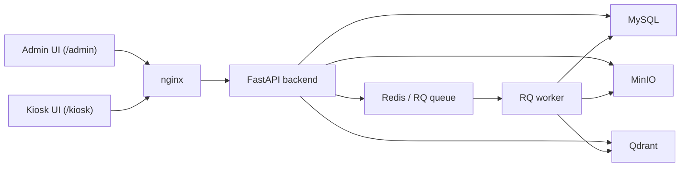

# ai-facial-recognition

Repo này đang được tổ chức theo xương sống của dự án check-in/check-out nhân viên bằng nhận diện khuôn mặt. Hiện repo gồm phần PoC AI đã hoàn thành ở Phase 1-2 và khung khởi động Phase 3 cho backend, worker và hạ tầng core.

- `docs/`: tài liệu đã giữ lại cho scope, architecture, deliverable và proposal
- `recognition/`: logic AI dùng chung cho PoC detect, embedding và cosine similarity
- `backend/`: khung FastAPI bám theo API contract, hiện mới scaffold route và healthcheck
- `worker/`: khung RQ worker cho luồng enrollment nền

## Repo Layout

```text
.
|-- backend/
|   |-- app/
|   `-- Dockerfile
|-- docs/
|   |-- project-scope.md
|   |-- architecture.md
|   |-- api-contract.md
|   |-- backlog.md
|   |-- demo-data.md
|   |-- registration-note.md
|   |-- tech-stack.md
|   `-- ...
|-- data/
|   `-- demo/
|-- recognition/
|   `-- pipelines/
|       |-- face_detect_embed.py
|       `-- cosine_similarity_eval.py
|-- requirements/
|   |-- poc.txt
|   |-- backend.txt
|   `-- worker.txt
|-- worker/
|   |-- app/
|   `-- Dockerfile
|-- docker-compose.yml
|-- .env.example
|-- .env.docker.example
|-- artifacts/        # generated locally, ignored by git
|-- .gitignore
`-- README.md
```

## Architecture Diagram



Xem thêm luồng nghiệp vụ tại `docs/diagrams.md`.

## Current Focus

- Chốt PoC detect + embedding bằng `InsightFace + OpenCV`
- Dùng dữ liệu demo local để kiểm tra enrolled vs unknown cho use case attendance
- Dựng khung Phase 3 cho `backend`, `worker`, `docker-compose.yml` và `.env.example`

## Next Phases

- Triển khai logic thật cho auth, employee CRUD, enrollment và attendance flow trong backend
- Kết nối worker với job tạo embedding và storage services
- Bổ sung `frontend/`, `nginx/`, `tests/` khi bắt đầu các phần tương ứng

## Quickstart

### PoC AI

1. Tạo virtualenv:

```powershell
python -m venv .venv
.venv\Scripts\Activate.ps1
```

2. Cài dependencies cho PoC:

```powershell
pip install -r requirements/poc.txt
```

3. Đặt ảnh demo vào `data/demo/`.
Xem quy ước và cấu trúc mẫu tại `docs/demo-data.md`.

4. Chạy PoC:

```powershell
python recognition/pipelines/face_detect_embed.py --input data/demo --output artifacts/poc/results.json --annotated-dir artifacts/poc/annotated
```

5. Đánh giá cosine similarity và threshold sơ bộ:

```powershell
python recognition/pipelines/cosine_similarity_eval.py --input data/demo --output artifacts/poc/cosine_similarity.json
```

### Scaffold Phase 3

1. Dev local với MySQL trong máy:

```powershell
Copy-Item .env.example .env
```

2. Xem hướng dẫn chi tiết ở `docs/database-setup.md`.

3. Khi cần chuyển sang Docker full stack:

```powershell
Copy-Item .env.docker.example .env.docker
docker compose --env-file .env.docker up -d mysql redis minio qdrant backend worker
```

4. Kiểm tra healthcheck backend:

```powershell
curl http://localhost:8000/healthz
```

## Notes

- Ảnh demo local trong `data/demo/` đang được ignore để tránh commit dữ liệu cá nhân.
- `artifacts/` chỉ là output local, không commit.
- Lần chạy đầu tiên có thể cần model weights của InsightFace.
- Nếu muốn trỏ local model weights, dùng thêm `--model-root <path>`.
- Các route trong `backend/` hiện là scaffold theo contract, chưa chứa logic nghiệp vụ thật.
- Giai đoạn hiện tại ưu tiên dev với MySQL local; Docker vẫn được giữ sẵn để chuyển sang môi trường đóng gói sau.
