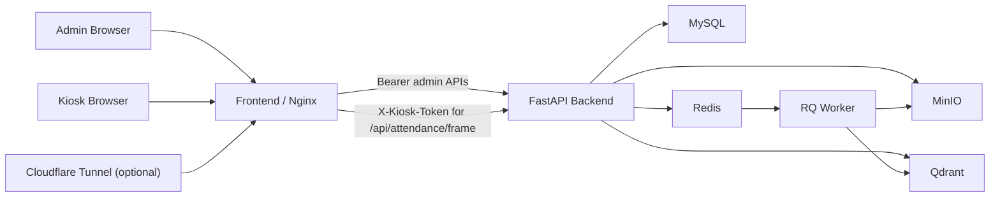

# AI Facial Recognition Attendance

Hệ thống MVP chấm công nhân viên bằng nhận diện khuôn mặt, gồm kiosk quét camera cho người dùng cuối và admin console để quản lý nhân sự, dữ liệu khuôn mặt, lịch sử chấm công, báo cáo theo ngày và cấu hình runtime an toàn.

## Chạy bản nộp

Yêu cầu:

- Docker Desktop
- Git

Lệnh chạy đúng theo đường nộp:

```powershell
docker compose pull
docker compose up -d
```

URL chính:

- Frontend: [http://localhost:8080](http://localhost:8080)
- Admin: [http://localhost:8080/login](http://localhost:8080/login)
- Kiosk: [http://localhost:8080/kiosk](http://localhost:8080/kiosk)
- Backend docs: [http://localhost:8000/docs](http://localhost:8000/docs)
- MinIO console: [http://localhost:9001](http://localhost:9001)

Tài khoản local seed mặc định:

```text
admin / admin123
```

Lưu ý: seed admin chỉ được tạo khi user chưa tồn tại. Restart backend/container sẽ không tự ghi đè mật khẩu, quyền hay trạng thái mà UI đã cập nhật.

## Kiến trúc



## Thành phần chính

| Thành phần | Vai trò |
| --- | --- |
| `frontend` | React 19 + Vite + Mantine, được serve bằng Nginx |
| `backend` | FastAPI monolith cho auth, employee, enrollment, attendance, reports, system settings |
| `worker` | RQ worker xử lý enrollment background jobs |
| `mysql` | Source of truth cho dữ liệu nghiệp vụ |
| `redis` | Queue cho RQ |
| `minio` | Object storage cho ảnh enrollment |
| `qdrant` | Vector database cho embedding khuôn mặt |
| `tunnel` | Cloudflare Quick Tunnel cho demo công khai có kiểm soát |

## Tính năng chính

- Kiosk check-in/check-out bằng camera, tự quét, có chống duplicate theo camera.
- Employee CRUD và face enrollment pipeline qua Redis/RQ + Qdrant.
- Dashboard tổng quan dùng backend summary làm source of truth.
- Attendance history có filter, xóa chọn lọc, xóa toàn bộ, export CSV.
- Daily reports theo business timezone `Asia/Ho_Chi_Minh`, có filter và export CSV.
- Admin user CRUD với 3 role: `owner`, `admin`, `viewer`.
- Writable system settings an toàn trong UI: threshold, face filters, business timezone, warm-up flag.

## Ánh xạ với yêu cầu đề bài

| Yêu cầu | Cách project đáp ứng |
| --- | --- |
| Frontend người dùng | Kiosk UI: camera, check-in/check-out, phản hồi nhận diện |
| Frontend quản trị | Dashboard, Người dùng/Quyền, Nhân viên, Enrollment, Chấm công, Báo cáo, Cấu hình |
| Backend | FastAPI |
| Database | MySQL |
| Object storage | MinIO |
| Vector database | Qdrant |
| Queue | Redis + RQ worker |
| Load balancer/Nginx | Nginx trong frontend container, proxy `/api` tới backend |
| CI/CD | GitHub Actions chạy test/build, publish Docker Hub image trên `main`, smoke-test đường nộp |
| Demo public | Cloudflare Tunnel qua `docker-compose.tunnel.yml` với fail-safe secrets |

## Người dùng, quyền và cấu hình

- `owner`: toàn quyền, quản lý tài khoản quản trị và writable system settings.
- `admin`: vận hành employee, enrollment, attendance, reports.
- `viewer`: xem dashboard, reports, history, settings ở chế độ chỉ đọc.
- `employee` là thực thể nghiệp vụ cho attendance, tách riêng với admin-console users.
- Seed admin chỉ là bootstrap account lúc ban đầu; sau khi đã tồn tại, lifecycle user được quản lý bằng UI/API, không bị env ghi đè ở mỗi lần restart.
- Trang `Admin -> Cấu hình` cho phép người dùng đã đăng nhập tự đổi mật khẩu.
- UI chỉ cho sửa cấu hình runtime an toàn; secret và hạ tầng như `JWT_SECRET_KEY`, DB, MinIO, Qdrant không writable qua web.

## Kiosk auth và public demo

Kiosk page vẫn là route public để flow demo không bị nặng, nhưng `POST /api/attendance/frame` không còn mở hoàn toàn:

- Direct call tới backend bắt buộc có header `X-Kiosk-Token`.
- Khi dùng kiosk qua `http://localhost:8080/kiosk`, Nginx sẽ tự inject token server-side.
- Token không được đưa vào bundle frontend/browser JavaScript.

Biến môi trường liên quan:

```env
KIOSK_API_TOKEN=local-kiosk-token
PUBLIC_DEMO_MODE=false
JWT_SECRET_KEY=change-me
SEED_ADMIN_PASSWORD=admin123
```

Nếu bật demo công khai qua Cloudflare Tunnel, backend sẽ fail startup nếu vẫn dùng giá trị mặc định cho:

- `SEED_ADMIN_PASSWORD`
- `JWT_SECRET_KEY`
- `KIOSK_API_TOKEN`

Checklist public demo:

1. Tạo hoặc sửa `.env.docker`
2. Đổi `SEED_ADMIN_PASSWORD`
3. Đổi `JWT_SECRET_KEY`
4. Đổi `KIOSK_API_TOKEN`
5. Chạy:

```powershell
docker compose -f docker-compose.yml -f docker-compose.tunnel.yml --profile tunnel up -d
```

Chi tiết thêm ở [docs/tunnel.md](docs/tunnel.md).

## Docker Hub và release path

Ba image chính:

```text
tlam281206/ai-facial-recognition-backend:latest
tlam281206/ai-facial-recognition-worker:latest
tlam281206/ai-facial-recognition-frontend:latest
```

Repo có hai cách chạy:

- `docker-compose.yml`: stack dùng image Docker Hub, đúng đường nộp
- `docker-compose.build.yml`: override build từ source local để smoke-test patch mới

Source-backed local smoke:

```powershell
docker compose -f docker-compose.yml -f docker-compose.build.yml up -d --build backend worker frontend
```

Publish image không làm thủ công trong repo này. Release path chính thức là:

1. push vào `main`
2. GitHub Actions build/push 3 image lên Docker Hub
3. workflow chạy smoke-test trên runner sạch bằng đúng:

```powershell
docker compose pull
docker compose up -d
```

## Luồng demo gợi ý

1. Mở `http://localhost:8080/login`, đăng nhập `owner`.
2. Xem Dashboard để kiểm tra summary 7/30 ngày.
3. Vào `Người dùng` tạo thêm account `admin` hoặc `viewer`.
4. Vào `Cấu hình` đổi mật khẩu và chỉnh threshold/timezone nếu cần.
5. Vào `Nhân viên`, tạo hoặc sửa nhân viên demo.
6. Upload 3-5 ảnh enrollment và chờ worker xử lý xong.
7. Mở `http://localhost:8080/kiosk`, cấp quyền camera.
8. Chọn `Check-in` hoặc `Check-out`, đưa mặt vào khung để kiosk tự quét.
9. Kiểm tra `Chấm công` và `Báo cáo` để xác nhận dữ liệu mới.

## Quy ước nghiệp vụ

- Business timezone: `Asia/Ho_Chi_Minh`
- Rule đi muộn: `first_check_in > 09:00`
- Dashboard và Reports dùng cùng aggregate từ backend
- Daily report/export bị cap 31 ngày mỗi request
- Attendance CSV raw events bị reject nếu filter hiện tại vượt 50.000 dòng

## Kiểm tra nhanh

```powershell
docker compose ps
docker compose logs backend --tail=100
docker compose logs worker --tail=100
```

Healthcheck:

```powershell
Invoke-WebRequest http://localhost:8000/healthz
Invoke-WebRequest http://localhost:8080/healthz
```

## Test

Backend:

```powershell
.\.venv\Scripts\python -m pytest tests\backend -q
```

Frontend:

```powershell
cd frontend
npm run lint
npm run build
```

## Tài liệu liên quan

- [docs/database-setup.md](docs/database-setup.md): cấu hình env/database
- [docs/demo-guide.md](docs/demo-guide.md): flow demo và xử lý lỗi
- [docs/ci-cd.md](docs/ci-cd.md): workflow CI/CD và Docker Hub publish
- [docs/tunnel.md](docs/tunnel.md): Cloudflare Tunnel cho demo public
