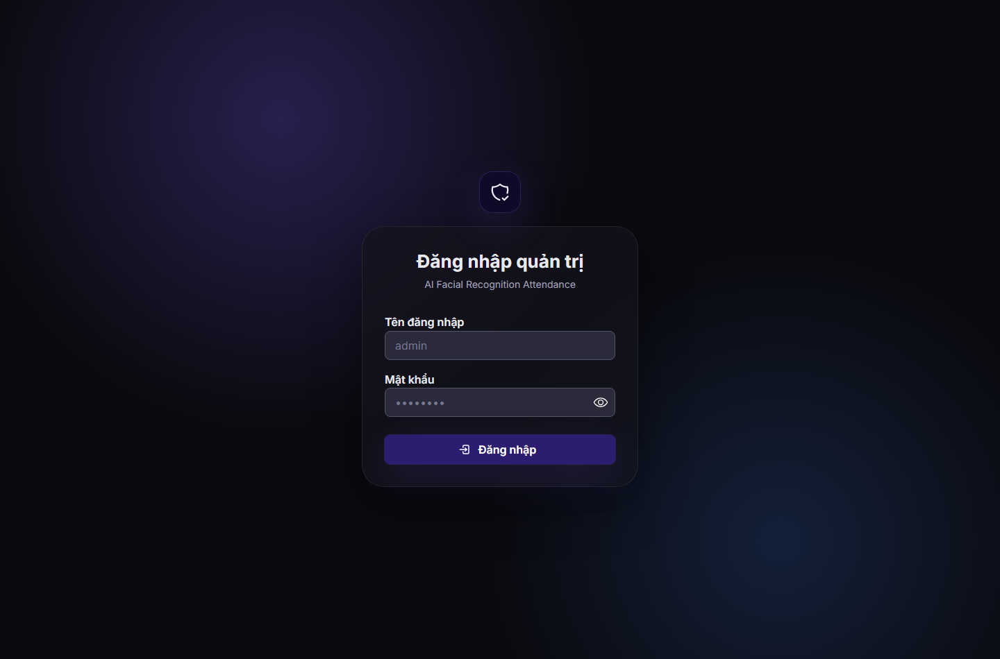
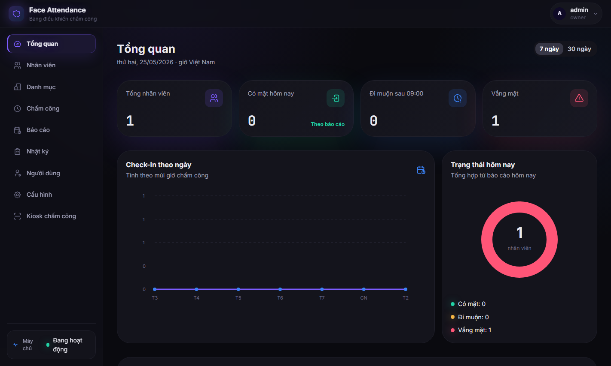
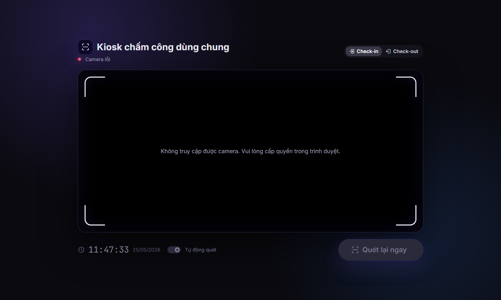
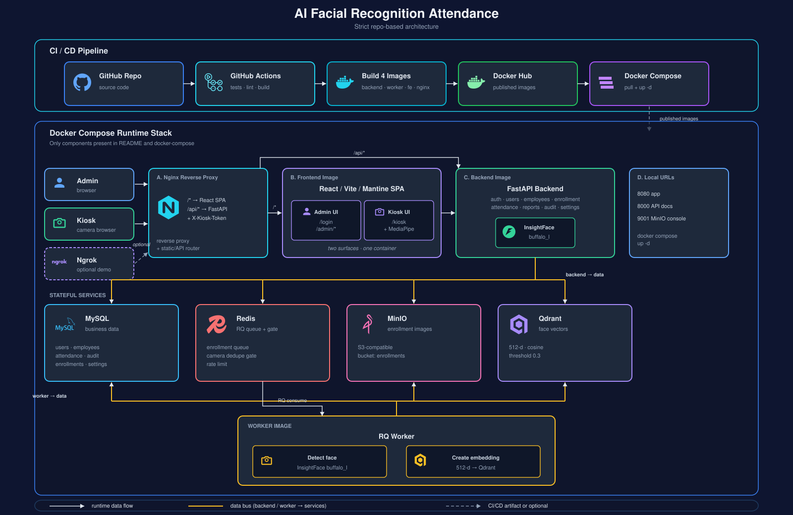

# AI Facial Recognition Attendance

Hệ thống chấm công nội bộ bằng nhận diện khuôn mặt. Sản phẩm gồm kiosk camera cho nhân viên check-in/check-out, trang quản trị cho vận hành nhân sự, backend xử lý nhận diện, worker nền tạo embedding, lưu trữ MySQL/MinIO/Qdrant/Redis và Nginx đứng trước toàn bộ stack.

## Chạy nhanh

Yêu cầu:

- Docker Desktop
- Git

Clone repo và chạy từ thư mục dự án:

```powershell
git clone <repo-url>
cd ai-facial-recognition
```

Chạy bản nộp bằng image đã publish:

```powershell
docker compose pull
docker compose up -d
```

Các URL chính:

| Mục | URL |
| --- | --- |
| Ứng dụng | [http://localhost:8080](http://localhost:8080) |
| Admin | [http://localhost:8080/login](http://localhost:8080/login) |
| Kiosk | [http://localhost:8080/kiosk](http://localhost:8080/kiosk) |
| API docs | [http://localhost:8000/docs](http://localhost:8000/docs) |
| MinIO console | [http://localhost:9001](http://localhost:9001) |

Tài khoản seed local:

```text
admin / admin123
```

Seed admin chỉ tạo khi DB chưa có user. Nếu đã đổi mật khẩu trong UI, restart container không ghi đè lại.

Dependency chính nằm trong `requirements/backend.txt`, `requirements/worker.txt`, `requirements/test.txt` và `frontend/package.json`.

## Demo

Ảnh demo được lưu trong repo để giảng viên có thể xem nhanh giao diện trước khi chạy Docker. Video demo nên nộp bằng link ngoài như Google Drive/YouTube hoặc trong phần mô tả nộp bài; không commit trực tiếp file `.mp4` lớn vào repo.

| Màn hình đăng nhập | Dashboard quản trị |
| --- | --- |
|  |  |

| Kiosk chấm công |
| --- |
|  |

## Kiến trúc



Thành phần chính:

| Thành phần | Vai trò |
| --- | --- |
| `frontend` | React/Vite/Mantine, gồm admin console và kiosk UI |
| `backend` | FastAPI cho auth, nhân viên, enrollment, chấm công, báo cáo, audit, cấu hình |
| `worker` | RQ worker xử lý ảnh enrollment và ghi embedding vào Qdrant |
| `mysql` | Dữ liệu nghiệp vụ: users, employees, attendance, audit, settings |
| `redis` | Queue enrollment và duplicate gate cho kiosk |
| `minio` | Lưu ảnh enrollment |
| `qdrant` | Vector database cho embedding khuôn mặt |
| `nginx` | Reverse proxy, route SPA/API và inject `X-Kiosk-Token` cho kiosk endpoint |

Sơ đồ chi tiết nằm trong [docs/diagrams.md](docs/diagrams.md).

Admin UI và Kiosk UI là hai route/module trong cùng một React SPA image `frontend`; đây vẫn là hai frontend surface riêng theo đề bài. Kiosk xử lý live camera ở browser, phát hiện mặt cục bộ bằng MediaPipe rồi gửi frame định kỳ lên backend để nhận diện bằng InsightFace/Qdrant. Đây là near real-time frame scanning, không phải video streaming WebSocket/WebRTC.

## Tính năng

- Kiosk check-in/check-out bằng camera, có tự quét và chống ghi trùng theo camera.
- Enrollment bằng upload ảnh hoặc camera 3 góc `front`, `left`, `right`.
- Quality gate ở frontend kiểm tra đúng 1 mặt, mặt đủ lớn và nằm trong khung trước khi chụp.
- CRUD nhân viên, danh mục phòng ban/chức vụ, quản lý tài khoản quản trị.
- Dashboard, lịch sử chấm công, báo cáo ngày và export CSV.
- Lọc event theo `recorded`, `unknown_face`, `multiple_faces`.
- Audit log cho thao tác quản trị nhạy cảm.
- Cấu hình runtime owner-only: threshold, timezone, tham số face gate.
- Validation dữ liệu user/employee để tránh mã nhân viên, username, password, phòng ban/chức vụ bị nhập loạn.

## Quyền sử dụng

| Role | Ý nghĩa |
| --- | --- |
| `owner` | Quản trị hệ thống: users, cấu hình, audit log, toàn bộ nghiệp vụ |
| `admin` | Vận hành nhân sự: danh mục, nhân viên, enrollment, chấm công, báo cáo |
| `viewer` | Xem dashboard, nhân viên, chấm công, báo cáo; không tạo/sửa/xóa |

Không có public signup. Tài khoản admin console do `owner` tạo. Hồ sơ `employee` là dữ liệu nghiệp vụ chấm công, tách riêng với tài khoản đăng nhập admin console.

## Mapping với yêu cầu đề bài

| Yêu cầu | Cách đáp ứng |
| --- | --- |
| Frontend người dùng | Kiosk UI hiển thị camera, trạng thái nhận diện và kết quả chấm công |
| Frontend quản trị | Admin UI quản lý users, quyền, cấu hình, nhân viên, enrollment, báo cáo |
| Backend | FastAPI |
| Database | MySQL |
| Object storage | MinIO |
| Vector database | Qdrant |
| Message/event queue | Redis + RQ worker cho tác vụ enrollment nền |
| Load balancer | Nginx đứng trước frontend/backend |
| Docker Compose | `docker-compose.yml` chạy toàn bộ stack |
| Docker Hub | 4 image: backend, worker, frontend, nginx |
| Điểm cộng | GitHub Actions CI/CD, Redis cache/gate, public demo bằng Ngrok HTTPS |

Repo không claim các hạng mục chưa triển khai production-grade như Kubernetes/Helm, monitoring sâu hoặc backup/restore tự động. Các phần này được ghi rõ ở mục giới hạn để tránh mô tả quá khả năng bản nộp.

## Cấu hình môi trường

Local demo dùng sẵn default trong compose. Nếu public demo qua Ngrok, tạo `.env.docker` từ `.env.docker.example` và đổi tối thiểu:

```env
PUBLIC_DEMO_MODE=true
SEED_ADMIN_PASSWORD=replace-with-strong-password
JWT_SECRET_KEY=replace-with-long-random-secret
KIOSK_API_TOKEN=replace-with-strong-kiosk-token
```

Ngrok cần thêm:

```env
NGROK_AUTHTOKEN=replace-with-ngrok-token
```

Lệnh public demo bằng Ngrok:

```powershell
docker compose --env-file .env.docker -f docker-compose.yml -f docker-compose.ngrok.yml --profile ngrok up -d
```

Lấy HTTPS URL public từ Ngrok inspector:

```powershell
(Invoke-RestMethod http://localhost:4040/api/tunnels).tunnels | Select-Object -ExpandProperty public_url
```

URL Ngrok free có thể đổi sau mỗi lần restart. Dùng public URL dạng `<public-url>/login` cho admin và `<public-url>/kiosk` cho kiosk. Camera browser ổn định hơn trên HTTPS public URL so với HTTP LAN.
Trình duyệt có thể hiện trang cảnh báo miễn phí của Ngrok ở lần mở đầu tiên; chọn tiếp tục vào site demo nếu URL đúng là URL bạn vừa lấy từ `localhost:4040`.

Tắt stack public demo:

```powershell
docker compose --env-file .env.docker -f docker-compose.yml -f docker-compose.ngrok.yml --profile ngrok down
```

Backend sẽ fail-fast khi bật `PUBLIC_DEMO_MODE=true` mà vẫn dùng secret mặc định.
Không commit `.env.docker`; file này chứa `NGROK_AUTHTOKEN`, admin password, JWT secret và kiosk token thật.

## Phát triển local

Backend:

```powershell
.\.venv\Scripts\python.exe -m alembic upgrade head
.\.venv\Scripts\python.exe -m uvicorn backend.app.main:app --host 127.0.0.1 --port 8000 --reload
```

Frontend:

```powershell
cd frontend
npm.cmd run dev
```

Build Docker từ mã nguồn local khi cần kiểm tra image:

```powershell
docker compose -f docker-compose.yml -f docker-compose.build.yml up -d --build backend worker frontend nginx
```

Đồng bộ `localhost:5173` và `localhost:8080`:

- `http://localhost:5173` là Vite dev server, luôn đọc trực tiếp source frontend mới nhất.
- `http://localhost:8080` là Nginx/Docker image, chỉ cập nhật sau khi build lại image `frontend` và `nginx`.
- Nếu đã sửa frontend rồi thấy `5173` mới hơn `8080`, chạy lại lệnh build Docker ở trên.
- Nếu đang bật Ngrok/public demo và muốn `8080` + public URL cùng ăn source mới, dùng:

```powershell
docker compose --env-file .env.docker -f docker-compose.yml -f docker-compose.build.yml -f docker-compose.ngrok.yml --profile ngrok up -d --build backend worker frontend nginx ngrok
```

Lưu ý URL đúng là `http://localhost:8080`; dạng `http://localhost8080` là thiếu dấu `:`.

Nếu cần nộp bằng image Docker Hub, sau khi build/test local phải push code lên `main` để GitHub Actions build và publish lại image. Nếu chỉ chạy `docker compose pull`, Docker sẽ lấy image đã publish gần nhất, không phải source local chưa push.

## Kiểm thử

Backend:

```powershell
.\.venv\Scripts\python.exe -m pytest tests\backend -q
```

Frontend:

```powershell
cd frontend
npm.cmd run test:run
npm.cmd run lint
npm.cmd run build
```

Docker config:

```powershell
docker compose config --quiet
docker compose --env-file .env.docker -f docker-compose.yml -f docker-compose.ngrok.yml --profile ngrok config --quiet
```

## Luồng demo gợi ý

1. `docker compose pull && docker compose up -d`.
2. Đăng nhập owner bằng `admin / admin123`.
3. Tạo phòng ban/chức vụ trong `Danh mục`.
4. Tạo nhân viên, chọn phòng ban/chức vụ từ danh mục.
5. Enrollment bằng camera 3 góc hoặc upload ảnh.
6. Mở kiosk, cấp quyền camera, check-in.
7. Bấm scan thủ công khi demo người lạ/nhiều mặt nếu cần lưu `unknown_face` hoặc `multiple_faces` vào lịch sử; auto scan ưu tiên giảm nhiễu nên không ghi mọi frame lỗi.
8. Xem `Chấm công`, lọc trạng thái nhận diện, export CSV.
9. Xem `Báo cáo` và `Nhật ký`.
10. Đăng nhập thử admin/viewer để chứng minh phân quyền.

Chi tiết demo và câu trả lời Q&A nằm trong [docs/demo-guide.md](docs/demo-guide.md).

## Giới hạn hiện tại

- Hệ thống tập trung vào một kiosk demo; multi-site/multi-camera là hướng mở rộng.
- Chưa có production-grade anti-spoofing. Bản demo có enrollment 3 góc và quality gate, nhưng ảnh in/video chất lượng cao vẫn cần model chống giả mạo chuyên dụng hoặc camera depth.
- Chưa có ca kíp, nghỉ phép, tăng ca, payroll.
- Snapshot chấm công chưa lưu dài hạn; bucket `snapshots` được giữ cho hướng mở rộng.
- Backup/restore tự động và monitoring sâu chưa nằm trong phạm vi bản nộp.

## Tài liệu

- [docs/architecture.md](docs/architecture.md): kiến trúc, scope, data flow, limitation.
- [docs/diagrams.md](docs/diagrams.md): các sơ đồ kỹ thuật chính.
- [docs/mysql-schema.sql](docs/mysql-schema.sql): MySQL DDL source để render/đối chiếu ERD.
- [docs/api-contract.md](docs/api-contract.md): API contract.
- [docs/demo-guide.md](docs/demo-guide.md): demo flow, dữ liệu demo, xử lý lỗi, Q&A.
- [docs/submission-checklist.md](docs/submission-checklist.md): checklist trước khi đóng GitHub và gửi bài.
