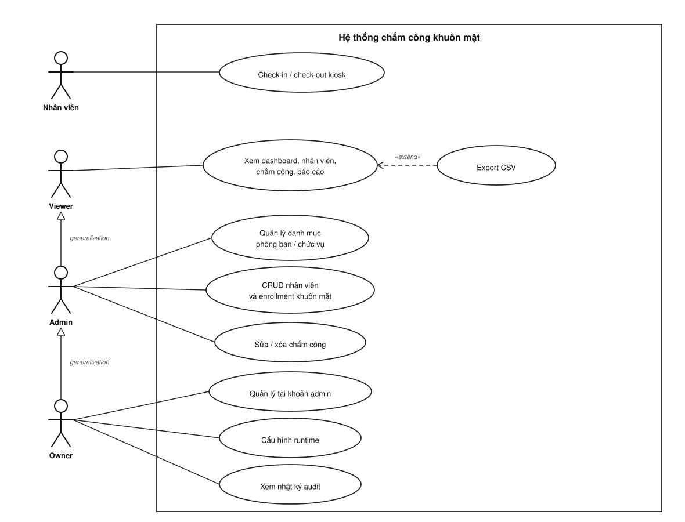
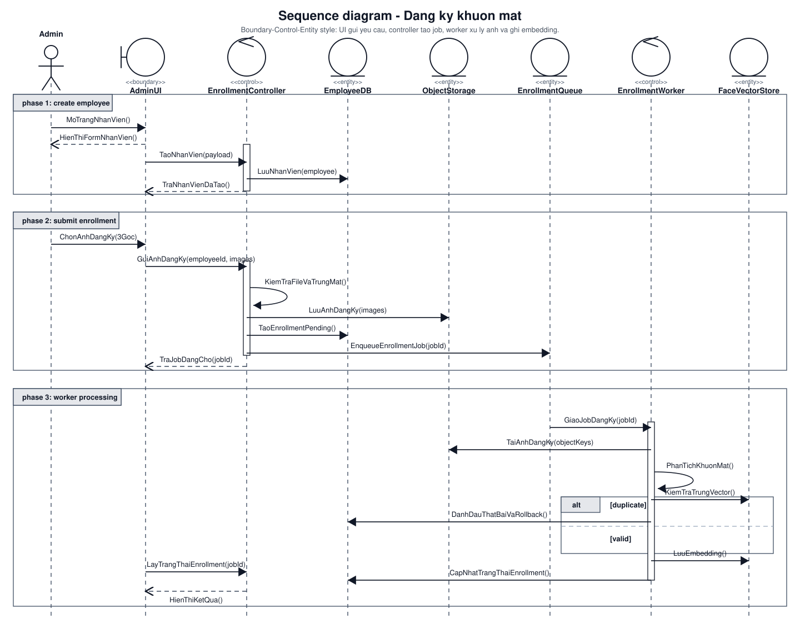
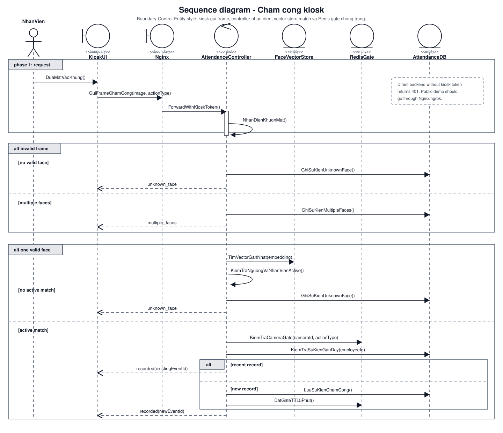
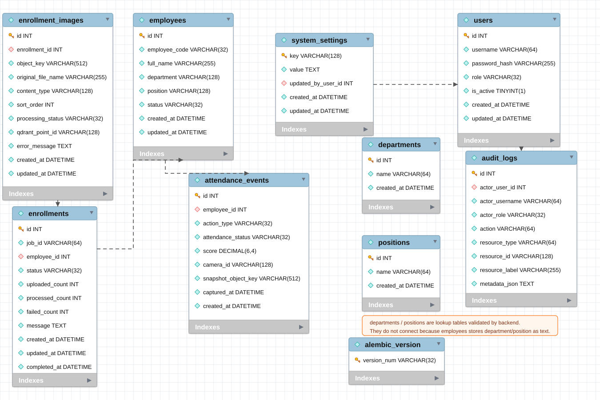
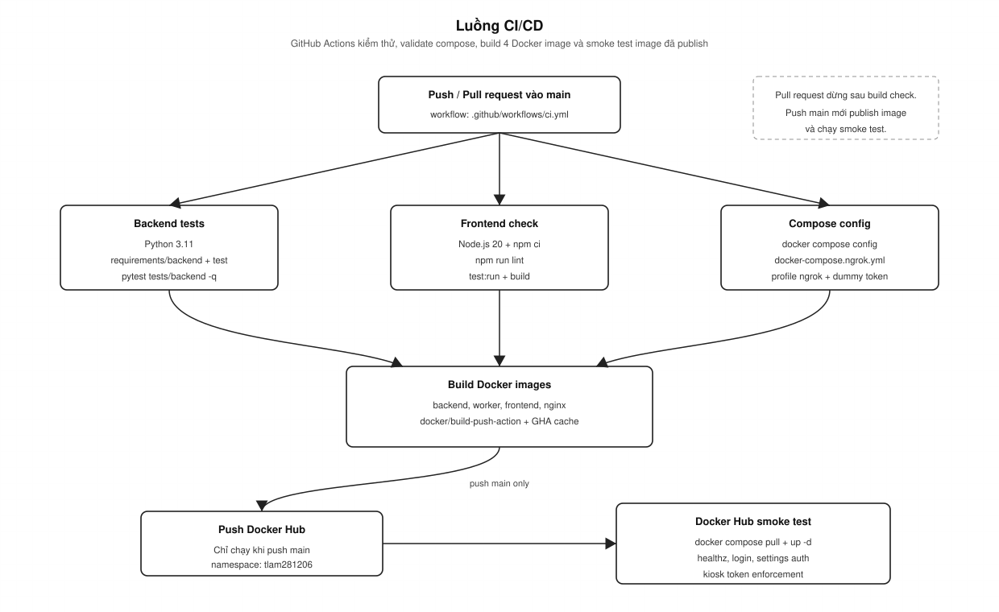

# Sơ đồ hệ thống

File này gom các sơ đồ chính của repo. Bản nhúng dùng SVG trong `docs/assets/` để GitHub render ổn định; hai sequence diagram có thêm file `.drawio` để chỉnh tiếp bằng diagrams.net khi cần.

## 1. Use case

Actor `Nhân viên` đứng trước kiosk, không cần đăng nhập. Ba actor admin console phân cấp bằng UML `generalization`: `Owner` là chuyên biệt của `Admin`, `Admin` là chuyên biệt của `Viewer`, nên cấp cao kế thừa toàn bộ use case của cấp dưới và chỉ cần liên kết tới use case "thêm". Đây không phải quan hệ `implementation`; trong use case diagram, `implementation` không phải quan hệ actor chuẩn. Quan hệ `«extend»` thể hiện Export mở rộng từ luồng xem/lọc dữ liệu.

## 2. Triển khai Docker Compose

Kiến trúc phân tầng: actor (Developer, Admin, Kiosk browser) → CI/CD pipeline đẩy 4 image lên Docker Hub → Docker Compose stack chạy reverse proxy (Nginx), application layer (Frontend / Backend / Worker) và data layer (MySQL / Redis / MinIO / Qdrant). Tunnel ngrok là tuỳ chọn cho public demo.

## 3. Luồng đăng ký khuôn mặt

Admin tạo nhân viên và gửi bộ ảnh enrollment. FastAPI lưu metadata vào MySQL, lưu ảnh vào MinIO, enqueue job vào Redis/RQ; worker xử lý ảnh nền, tạo embedding và ghi vector vào Qdrant.

Source draw.io: [`assets/enrollment-sequence.drawio`](assets/enrollment-sequence.drawio)

## 4. Luồng chấm công

Kiosk gửi frame qua Nginx để được inject `X-Kiosk-Token`. Backend detect face, tạo embedding, tìm nearest vector trong Qdrant, kiểm tra nhân viên active và dùng Redis gate để tránh ghi trùng trong cửa sổ ngắn.

Source draw.io: [`assets/attendance-sequence.drawio`](assets/attendance-sequence.drawio)

## 5. ERD

Source draw.io: [`assets/erd.drawio`](assets/erd.drawio)

Source MySQL DDL để import/render lại bằng ERDPlus, MySQL Workbench, DBeaver hoặc DataGrip: [`mysql-schema.sql`](mysql-schema.sql)

Ghi chú: ERD theo physical schema nên chỉ các foreign key thật mới có đường nối. `departments`, `positions` không nối vì `employees.department` và `employees.position` lưu tên đã chọn từ danh mục thay vì lưu `department_id` / `position_id`. `alembic_version` là bảng metadata của Alembic để tracking migration, không thuộc nghiệp vụ nên cũng không nối.

## 6. Luồng CI/CD

Smoke test kiểm tra healthcheck, login, owner-only settings và kiosk token enforcement.
