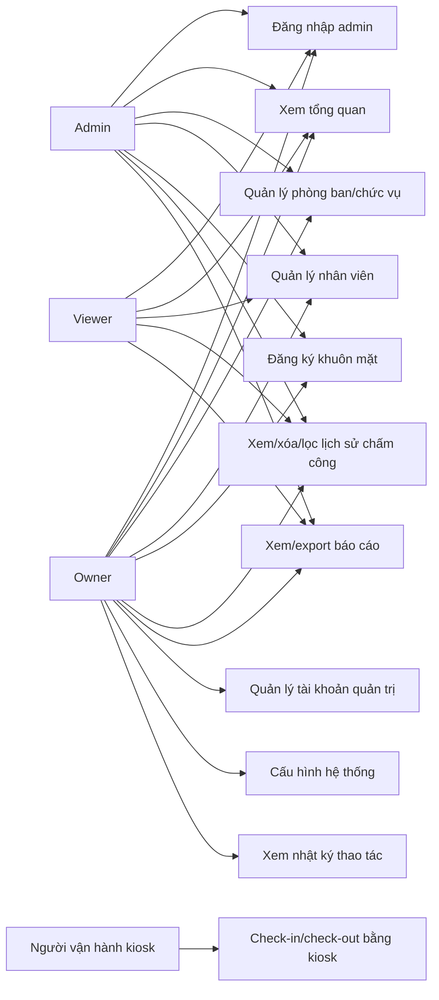
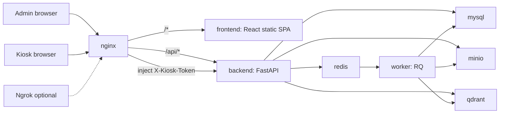
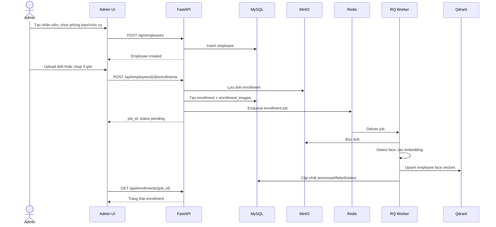
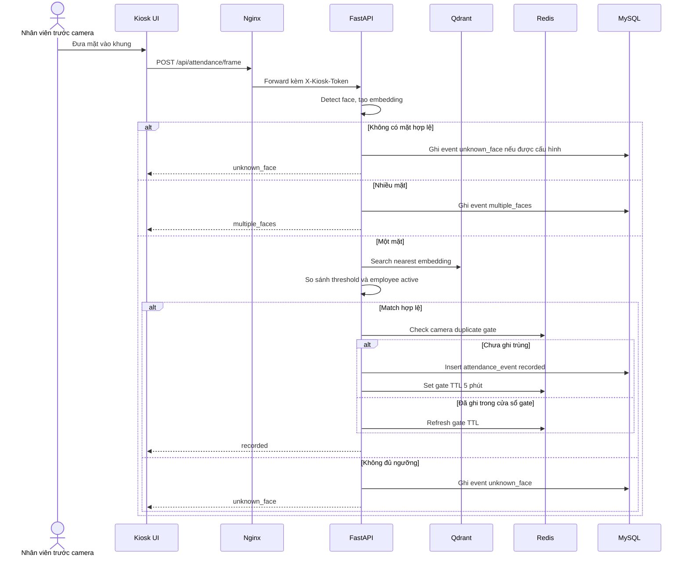
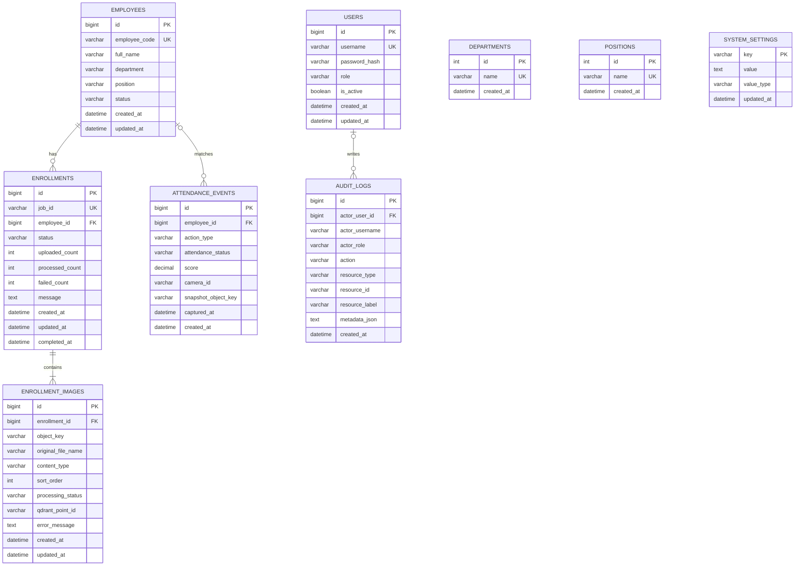
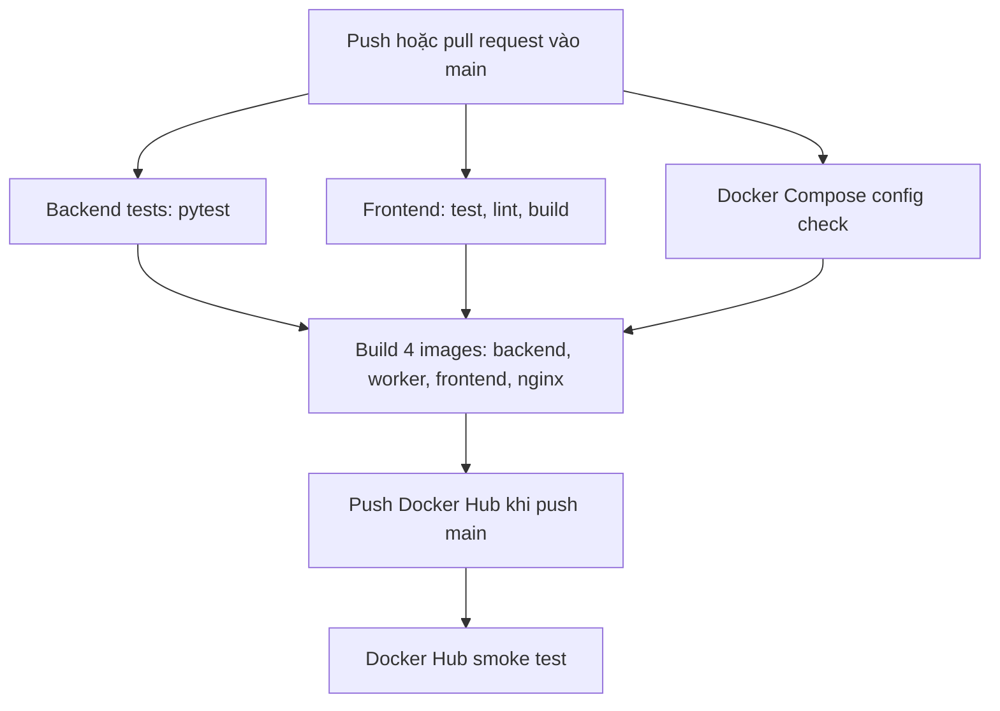

# Sơ đồ hệ thống

File này là nguồn sơ đồ chính của repo. Các sơ đồ dùng Mermaid để GitHub render trực tiếp và dễ chỉnh khi code thay đổi.

## 1. Use case

## 2. Triển khai Docker Compose

## 3. Luồng đăng ký khuôn mặt

## 4. Luồng chấm công

## 5. ERD

Ghi chú: `employees.department` và `employees.position` lưu tên đã chọn từ danh mục. Bản hiện tại không dùng foreign key để giữ dữ liệu báo cáo ổn định nếu tên danh mục thay đổi sau này.

## 6. Luồng CI/CD

Smoke test kiểm tra healthcheck, login, owner-only settings và kiosk token enforcement.
