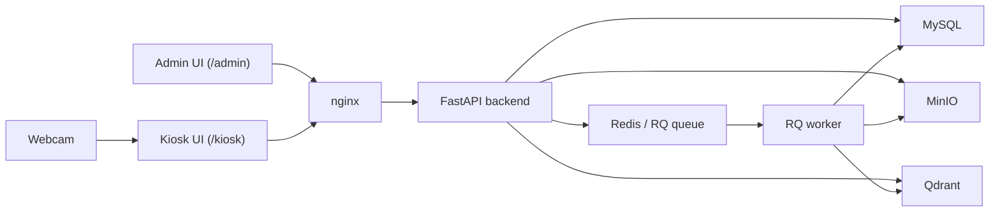
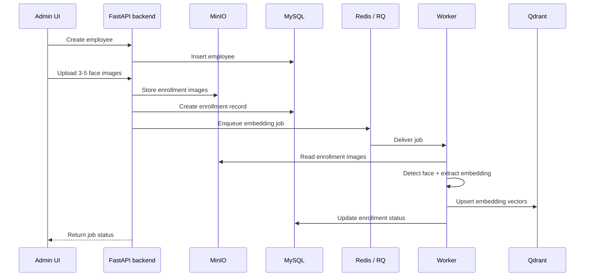
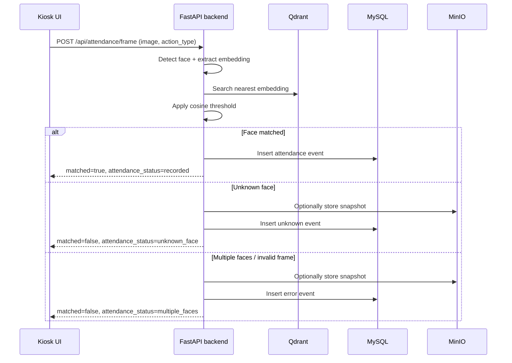
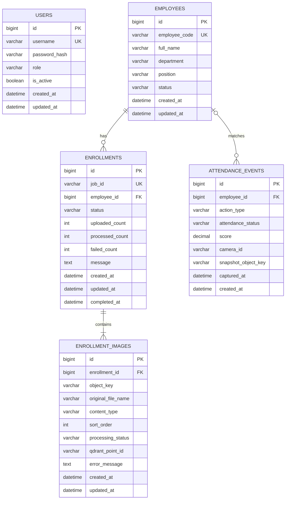

# Diagrams

## 1. System Architecture

## 2. Enrollment Flow

## 3. Attendance Recognition Flow

## 4. ERD Draft Cho MySQL

### Ghi chú chốt để bám vào schema

- `users` chỉ phục vụ đăng nhập admin trong MVP. Chưa thêm audit trail như `created_by`, `updated_by`.
- `employees` là thực thể nghiệp vụ chính cho CRUD admin và attendance history.
- `enrollments` đại diện cho 1 lần upload ảnh đăng ký của 1 nhân viên, bám theo `job_id`, `status`, `uploaded_count`, `processed_count`, `failed_count`.
- `enrollment_images` là bảng phụ cần có để lưu metadata của từng ảnh upload vào MinIO. Mỗi record tương ứng 1 file ảnh trong một enrollment.
- Giả định MVP: mỗi `enrollment_image` sau khi xử lý thành công sẽ map tới đúng 1 vector trong Qdrant qua `qdrant_point_id`.
- `attendance_events.employee_id` cho phép `NULL` để lưu các case `unknown_face` hoặc `multiple_faces`.
- `attendance_events.snapshot_object_key` cho phép `NULL`; chỉ dùng khi cần lưu snapshot debug trong MinIO.

### Giá trị enum dự kiến cho MVP

- `employees.status`: `active`, `inactive`
- `enrollments.status`: `pending`, `success`, `failed`
- `enrollment_images.processing_status`: `pending`, `success`, `failed`
- `attendance_events.action_type`: `check_in`, `check_out`
- `attendance_events.attendance_status`: `recorded`, `unknown_face`, `multiple_faces`
