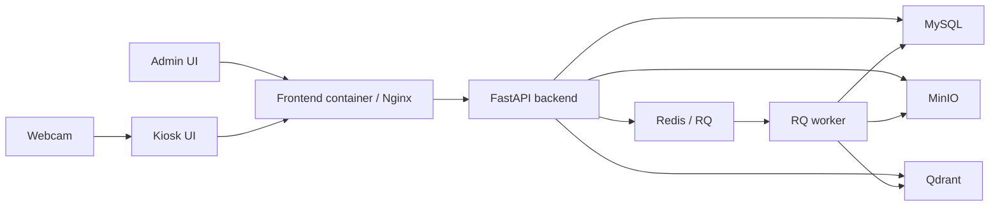
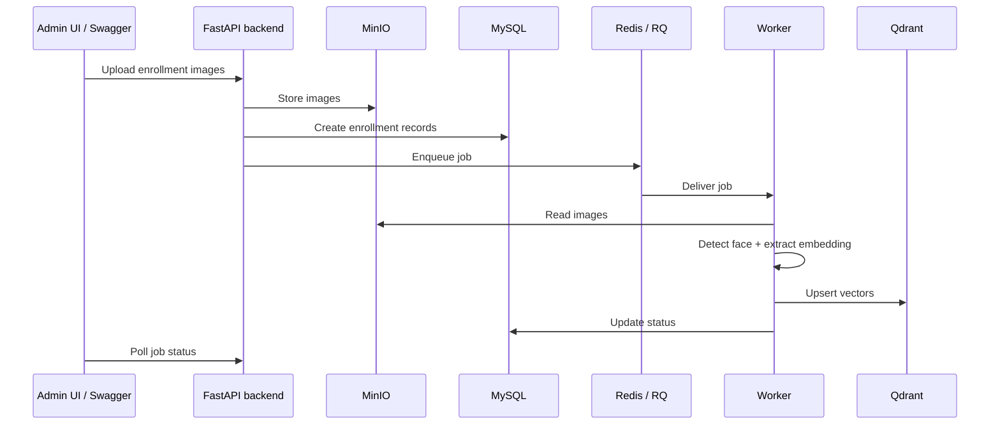
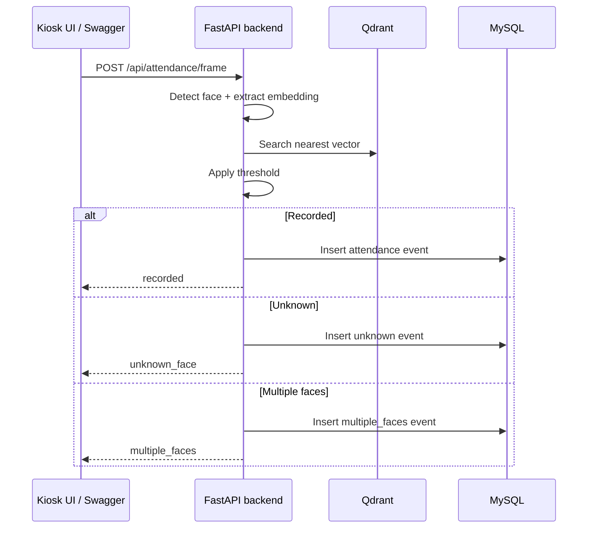
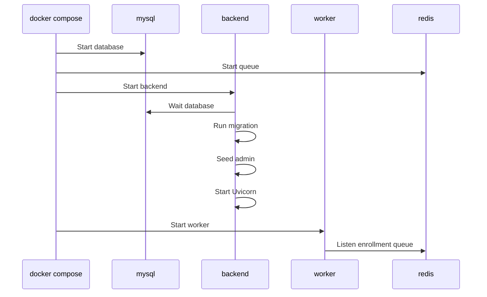
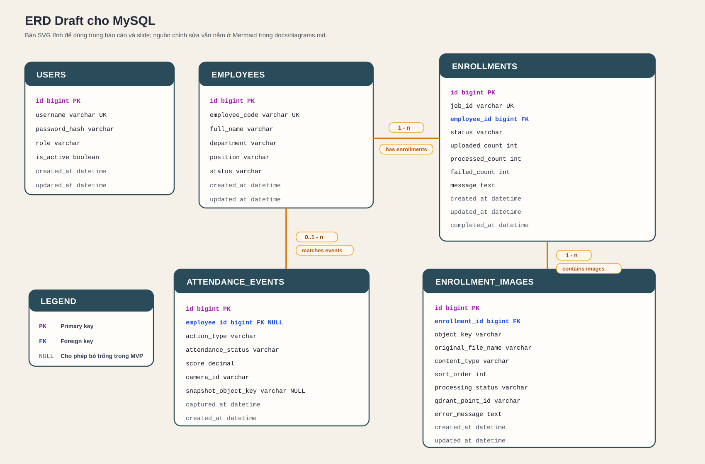
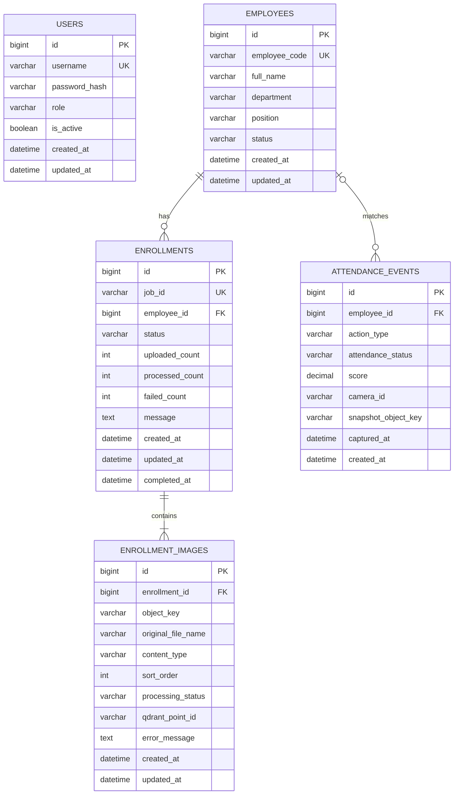

# Sơ đồ hệ thống

Cập nhật: `2026-05-08`.

## 1. Kiến trúc cuối cùng

```mermaid
flowchart LR
    Admin["Admin UI"]
    Kiosk["Kiosk UI"]
    Frontend["Frontend container / Nginx"]
    Backend["FastAPI backend"]
    Worker["RQ worker"]
    Redis["Redis / RQ"]
    MySQL["MySQL"]
    MinIO["MinIO"]
    Qdrant["Qdrant"]
    Camera["Webcam"]

    Admin --> Frontend
    Kiosk --> Frontend
    Camera --> Kiosk
    Frontend --> Backend
    Backend --> MySQL
    Backend --> MinIO
    Backend --> Qdrant
    Backend --> Redis
    Redis --> Worker
    Worker --> MinIO
    Worker --> Qdrant
    Worker --> MySQL
```

## 2. Enrollment

```mermaid
sequenceDiagram
    participant Admin as Admin UI / Swagger
    participant Backend as FastAPI backend
    participant MinIO as MinIO
    participant MySQL as MySQL
    participant Redis as Redis / RQ
    participant Worker as Worker
    participant Qdrant as Qdrant

    Admin->>Backend: Upload enrollment images
    Backend->>MinIO: Store images
    Backend->>MySQL: Create enrollment records
    Backend->>Redis: Enqueue job
    Redis->>Worker: Deliver job
    Worker->>MinIO: Read images
    Worker->>Worker: Detect face + extract embedding
    Worker->>Qdrant: Upsert vectors
    Worker->>MySQL: Update status
    Admin->>Backend: Poll job status
```

## 3. Attendance

```mermaid
sequenceDiagram
    participant Kiosk as Kiosk UI / Swagger
    participant Backend as FastAPI backend
    participant Qdrant as Qdrant
    participant MySQL as MySQL

    Kiosk->>Backend: POST /api/attendance/frame
    Backend->>Backend: Detect face + extract embedding
    Backend->>Qdrant: Search nearest vector
    Backend->>Backend: Apply threshold

    alt Recorded
        Backend->>MySQL: Insert attendance event
        Backend-->>Kiosk: recorded
    else Unknown
        Backend->>MySQL: Insert unknown event
        Backend-->>Kiosk: unknown_face
    else Multiple faces
        Backend->>MySQL: Insert multiple_faces event
        Backend-->>Kiosk: multiple_faces
    end
```

## 4. Docker startup

```mermaid
sequenceDiagram
    participant Compose as docker compose
    participant MySQL as mysql
    participant Backend as backend
    participant Worker as worker
    participant Redis as redis

    Compose->>MySQL: Start database
    Compose->>Redis: Start queue
    Compose->>Backend: Start backend
    Backend->>MySQL: Wait database
    Backend->>Backend: Run migration
    Backend->>Backend: Seed admin
    Backend->>Backend: Start Uvicorn
    Compose->>Worker: Start worker
    Worker->>Redis: Listen enrollment queue
```

## 5. ERD

```mermaid
erDiagram
    USERS {
        bigint id PK
        varchar username UK
        varchar password_hash
        varchar role
        boolean is_active
        datetime created_at
        datetime updated_at
    }

    EMPLOYEES {
        bigint id PK
        varchar employee_code UK
        varchar full_name
        varchar department
        varchar position
        varchar status
        datetime created_at
        datetime updated_at
    }

    ENROLLMENTS {
        bigint id PK
        varchar job_id UK
        bigint employee_id FK
        varchar status
        int uploaded_count
        int processed_count
        int failed_count
        text message
        datetime created_at
        datetime updated_at
        datetime completed_at
    }

    ENROLLMENT_IMAGES {
        bigint id PK
        bigint enrollment_id FK
        varchar object_key
        varchar original_file_name
        varchar content_type
        int sort_order
        varchar processing_status
        varchar qdrant_point_id
        text error_message
        datetime created_at
        datetime updated_at
    }

    ATTENDANCE_EVENTS {
        bigint id PK
        bigint employee_id FK
        varchar action_type
        varchar attendance_status
        decimal score
        varchar camera_id
        varchar snapshot_object_key
        datetime captured_at
        datetime created_at
    }

    EMPLOYEES ||--o{ ENROLLMENTS : has
    ENROLLMENTS ||--|{ ENROLLMENT_IMAGES : contains
    EMPLOYEES o|--o{ ATTENDANCE_EVENTS : matches
```
